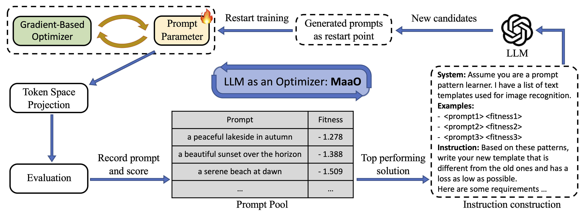

# LLM-catalyst

Official pytorch implementation of **Two Optimizers Are Better Than One: LLM Catalyst for Enhancing Gradient-Based Optimization**.

<!-- [[arxiv](https://arxiv.org/)]  -->

[](https://arxiv.org/abs/)

<center>

</center>

We proposed a combined optimization method that integrates LLM-based optimizer with conventional gradient-based optimization. We validated our combined optimization strategy through prompt tuning tasks, where the synergy between LLM-based optimizer and gradient-based optimizer has consistently demonstrated improved performance over competitive baselines.

For more details, please see the [paper](https://arxiv.org/abs/2405.19732).

Contact us with zixian_guo@foxmail.com


## Setup
### 1. Environment

The version of mainly used packages:

```
python==3.9.18
pytorch==2.1.2+cu118
torchvision==0.15.2+cu118
transformers==4.11.3
datasets==2.19.1
```

Install Dassl (For vision-language tasks):

```
cd ./exp_vlm/Dassl.pytorch-master/
# Install dependencies
pip install -r requirements.txt
# Install this library (no need to re-build if the source code is modified)
python setup.py develop
```

Install other dependencies:
```
cd ./
# Install dependencies
pip install -r requirements.txt
```

### 2. Datasets

The datasets of SuperGLUE will be organized by `datasets`.

The image classfication datasets are prepared according to [].

### 3. LLM API


## Usage
### 1. NLU tasks

Prompt tuning baseline results (take COPA dataset as an example):
```
cd ./exp_lm
bash run_script/run_copa_roberta.sh
```

Prompt tuning with our method baseline:
```
bash run_script/run_copa_roberta_llm.sh
```

After training, check the improvements brought by our method by comparing the result in corresponding directory: `exp_lm/checkpoints/PT-copa-roberta-psl8-seed1` and `exp_lm/checkpoints/PT-copa-roberta-psl8-llm-seed1`

Traning scripts for other datasets can be found in `./exp_lm/run_script/`.


<!-- ### 2. Image classification tasks -->


## Citation

```bibtex
@misc{guoTwoOptimizersAre2024,
  title = {Two Optimizers Are Better Than One: LLM Catalyst for Enhancing Gradient-Based Optimization},
  shorttitle = {Two Optimizers Are Better Than One},
  author = {Guo, Zixian and Liu, Ming and Ji, Zhilong and Bai, Jinfeng and Guo, Yiwen and Zuo, Wangmeng},
  year = {2024},
  month = may,
  number = {arXiv:2405.19732},
  eprint = {2405.19732},
  primaryclass = {cs},
  publisher = {arXiv},
  urldate = {2024-05-31},
  archiveprefix = {arxiv}
}
```

## Acknowledgement

We borrows code from [CoOp](https://github.com/KaiyangZhou/CoOp), [Dassl](https://github.com/KaiyangZhou/Dassl.pytorch) and [P-tuning](https://github.com/THUDM/P-tuning-v2), which are great repositories and we encourage you to check them out and cite them in your work.

